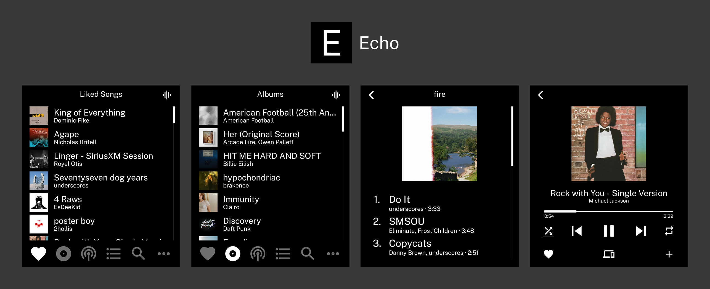

<p>A minimal Spotify client for the Light Phone III.</p>


> [!NOTE]
> There are a few steps required to complete before you can use Echo. Please read the [Setup](#setup) section below.
> Echo is primarily designed for the Light Phone III, it may work on other Android devices but is not guaranteed to function properly.

## Installation
The lastest .apk file is available in [releases](https://github.com/vandamd/echo/releases/latest).

I recommend using [Obtainium](https://github.com/ImranR98/Obtainium) and adding the repository's URL to receive updates.

## Setup
### Prerequisites
- Spotify installed on your device. (You can use Aurora Store to install it)
- Active Spotify Premium subscription.
- Your account is logged in on the Spotify app on your Light Phone III.

### 1. Create a Spotify Developer App
1. Go to [developer.spotify.com/dashboard](https://developer.spotify.com/dashboard)
2. Click **Create App**
3. Fill in the app name and description
4. Set the **Redirect URI** to `echo://callback`
5. Select **Android** and **Web API** under "Which API/SDKs are you planning to use?"
6. Accept the terms and click **Save**
7. Go to **Settings** and note your **Client ID** and **Client Secret**
8. Under **Basic Information**, add your Android package:
   - **Package Name**: `com.vandam.echo`
   - **SHA1 Fingerprint**: `73:25:19:F7:40:25:9D:F2:B0:B2:CC:C1:5D:09:D6:7E:72:20:C2:64`
9. Click **Save**

### 2. Configure Echo
1. Open Echo on your device
2. Enter your **Client ID** from the Spotify Dashboard
3. Enter your **Client Secret** from the Spotify Dashboard
4. Tap Login and you should be prompted to give Echo permission to access your Spotify account's data.
5. If successful, you should see your Spotify liked songs!

## Features
- Song library with full playback
- Playback controls (play/pause, skip, seek, shuffle, repeat)
- Browse artists, albums, playlists and podcasts
- Like, unlike and add to playlists
- Device selection for remote playback

## Limitations
- Requires the Spotify app to be installed
- No Spotify owned content (e.g. Radio, Daylist, Playlists like "Discover Weekly")
- No queue management
- Limited offline functionality
- Liked song playback is currently using some not-so-great workarounds, so expect some bugs! Playlist and album playback should work fine though.

## Greyscale Toggle
Echo can automatically disable greyscale while the app is open and restore it when you leave.

This requires granting the app special permission via ADB:

```bash
adb shell pm grant com.vandam.echo android.permission.WRITE_SECURE_SETTINGS
```

## Support
Echo is developed and maintained in my free time.

If you find it useful, please [consider sponsoring](https://github.com/sponsors/vandamd)! :)
