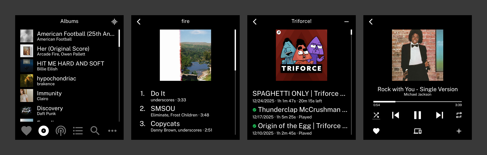

# Echo

A minimal Spotify client for the Light Phone III.



## Setup

### 1. Create a Spotify App

1. Go to [developer.spotify.com/dashboard](https://developer.spotify.com/dashboard)
2. Click **Create App**
3. Fill in the app name and description
4. Set the **Redirect URI** to `echo://callback`
5. Select **Android** and **Web API** under "Which API/SDKs are you planning to use?"
6. Accept the terms and click **Save**
7. Go to **Settings** and note your **Client ID** and **Client Secret**
8. Under **Basic Information**, add your Android package:
   - **Package Name**: `com.vandam.echo`
   - **SHA1 Fingerprint**: `73:25:19:F7:40:25:9D:F2:B0:B2:CC:C1:5D:09:D6:7E:72:20:C2:64`
9. Click **Save**

### 2. Deploy a Token Exchange Server

See [echo-token-server](https://github.com/vandamd/echo-token-server) for setup instructions.

### 3. Configure Echo

1. Open Echo on your device
2. Enter your **Client ID** from the Spotify Dashboard
3. Enter your **Server URL** (e.g. `https://your-server.com`)
4. Tap the arrow to save, then log in with Spotify

## Greyscale Permission

```bash
adb shell pm grant com.vandam.echo android.permission.WRITE_SECURE_SETTINGS
```

This allows the app to disable greyscale when opened and restore it when closed.
